# Bike Sharing Demand

**Author:** Nihit R. Save <br />
**Date:** 23rd March 2017 <br />

## Problem Statement
We are provided with hourly bike rental data spanning two years. For this competition, the training set is comprised of the first 19 days of each month, while the test set is the 20th to the end of the month.We are asked to combine historical usage patterns with weather data in order to forecast bike rental demand in the Capital Bikeshare program in Washington, D.C. 

## Dataset Information
The train and test data, which can be found at the link given above, contain the following variables:


Variable | Description
| ------------- |:-------------|
datetime | hourly date + timestamp  
season |  1 = spring, 2 = summer, 3 = fall, 4 = winter 
holiday | whether the day is considered a holiday
workingday | whether the day is neither a weekend nor holiday
weather | 1: Clear, Few clouds, Partly cloudy, Partly cloudy <br />  2: Mist + Cloudy, Mist + Broken clouds, Mist + Few clouds, Mist <br /> 3: Light Snow, Light Rain + Thunderstorm + Scattered clouds, Light Rain + Scattered clouds <br /> 4: Heavy Rain + Ice Pallets + Thunderstorm + Mist, Snow + Fog 
temp | temperature in Celsius
atemp | "feels like" temperature in Celsius
humidity | relative humidity
windspeed | wind speed
casual | number of non-registered user rentals initiated
registered | number of registered user rentals initiated
count | number of total rentals


## Data Exploration


Loading Dataset from the work directory.

``` r
train <- read.csv("train.csv")
test <- read.csv("test.csv")
```

Exploring data and data types in train dataset.

``` r
str(train)
```

    ## 'data.frame':    10886 obs. of  12 variables:
    ##  $ datetime  : Factor w/ 10886 levels "2011-01-01 00:00:00",..: 1 2 3 4 5 6 7 8 9 10 ...
    ##  $ season    : int  1 1 1 1 1 1 1 1 1 1 ...
    ##  $ holiday   : int  0 0 0 0 0 0 0 0 0 0 ...
    ##  $ workingday: int  0 0 0 0 0 0 0 0 0 0 ...
    ##  $ weather   : int  1 1 1 1 1 2 1 1 1 1 ...
    ##  $ temp      : num  9.84 9.02 9.02 9.84 9.84 ...
    ##  $ atemp     : num  14.4 13.6 13.6 14.4 14.4 ...
    ##  $ humidity  : int  81 80 80 75 75 75 80 86 75 76 ...
    ##  $ windspeed : num  0 0 0 0 0 ...
    ##  $ casual    : int  3 8 5 3 0 0 2 1 1 8 ...
    ##  $ registered: int  13 32 27 10 1 1 0 2 7 6 ...
    ##  $ count     : int  16 40 32 13 1 1 2 3 8 14 ...

The variables season,holiday,workingday and weather are stored as int and we shall convert them to factor during later stages.

Checking for missing values.

``` r
table(is.na(train))
```

    ## 
    ##  FALSE 
    ## 130632

There are no missing values in our train data set.

Observing the distribution of variables in dataset.

``` r
summary(train)
```

    ##                 datetime         season         holiday       
    ##  2011-01-01 00:00:00:    1   Min.   :1.000   Min.   :0.00000  
    ##  2011-01-01 01:00:00:    1   1st Qu.:2.000   1st Qu.:0.00000  
    ##  2011-01-01 02:00:00:    1   Median :3.000   Median :0.00000  
    ##  2011-01-01 03:00:00:    1   Mean   :2.507   Mean   :0.02857  
    ##  2011-01-01 04:00:00:    1   3rd Qu.:4.000   3rd Qu.:0.00000  
    ##  2011-01-01 05:00:00:    1   Max.   :4.000   Max.   :1.00000  
    ##  (Other)            :10880                                    
    ##    workingday        weather           temp           atemp      
    ##  Min.   :0.0000   Min.   :1.000   Min.   : 0.82   Min.   : 0.76  
    ##  1st Qu.:0.0000   1st Qu.:1.000   1st Qu.:13.94   1st Qu.:16.66  
    ##  Median :1.0000   Median :1.000   Median :20.50   Median :24.24  
    ##  Mean   :0.6809   Mean   :1.418   Mean   :20.23   Mean   :23.66  
    ##  3rd Qu.:1.0000   3rd Qu.:2.000   3rd Qu.:26.24   3rd Qu.:31.06  
    ##  Max.   :1.0000   Max.   :4.000   Max.   :41.00   Max.   :45.45  
    ##                                                                  
    ##     humidity        windspeed          casual         registered   
    ##  Min.   :  0.00   Min.   : 0.000   Min.   :  0.00   Min.   :  0.0  
    ##  1st Qu.: 47.00   1st Qu.: 7.002   1st Qu.:  4.00   1st Qu.: 36.0  
    ##  Median : 62.00   Median :12.998   Median : 17.00   Median :118.0  
    ##  Mean   : 61.89   Mean   :12.799   Mean   : 36.02   Mean   :155.6  
    ##  3rd Qu.: 77.00   3rd Qu.:16.998   3rd Qu.: 49.00   3rd Qu.:222.0  
    ##  Max.   :100.00   Max.   :56.997   Max.   :367.00   Max.   :886.0  
    ##                                                                    
    ##      count      
    ##  Min.   :  1.0  
    ##  1st Qu.: 42.0  
    ##  Median :145.0  
    ##  Mean   :191.6  
    ##  3rd Qu.:284.0  
    ##  Max.   :977.0  
    ## 

We notice that our response variables have outliers.

Combining the Train and Test dataset for further exploration and manipulation.

``` r
test$casual <- NA
test$registered <- NA
test$count <- NA

combined <- rbind(train,test)
```

## Extracting New Features from Date


The library lubridate allows us to extract features from a POSIXct object. Extracting time and day variables.

``` r
library(lubridate)
combined$datetime <- ymd_hms(combined$datetime)


combined$hour <- factor(hour(combined$datetime))

combined$weekday <- factor(wday(combined$datetime,label = T),ordered = F)

combined$year <- factor(year(combined$datetime))
```

## Data Manipulation


As we noticed in structure of dataset some variables are stored as integer and we shall convert them to factor.

``` r
combined$season <- factor(combined$season, labels = c("Spring","Summer","Fall","Winter"))
combined$weather <- factor(combined$weather, labels = c("Clear","Mist","Light Rain/Snow","Heavy Rain/Snow"))

combined$workingday <- factor(combined$workingday, labels = c("No","Yes"))
```

On weekends there is holiday and therefore we shall set holiday to 1 if it is a weekend.

``` r
library(plyr)
```

  
``` r
library(dplyr)
```

   

``` r
combined <- ddply(combined,~datetime,transform,holiday = ifelse(weekday %in% c("Sat","Sun"),"1",holiday))

combined$holiday <- factor(combined$holiday, labels = c("No","Yes"))
```

## Data Visualization


Loading required libraries

``` r
library(ggplot2)
library(scales)
library(gridExtra)
```

``` r
ggplot(data = combined, aes(x = count)) + geom_histogram(col = "black",binwidth = 50) + scale_x_continuous(breaks = seq(0,1000,50)) + xlab("") + ylab("Number of Bike Rentals") + ggtitle("Distribution of Response Variable") 
```

 

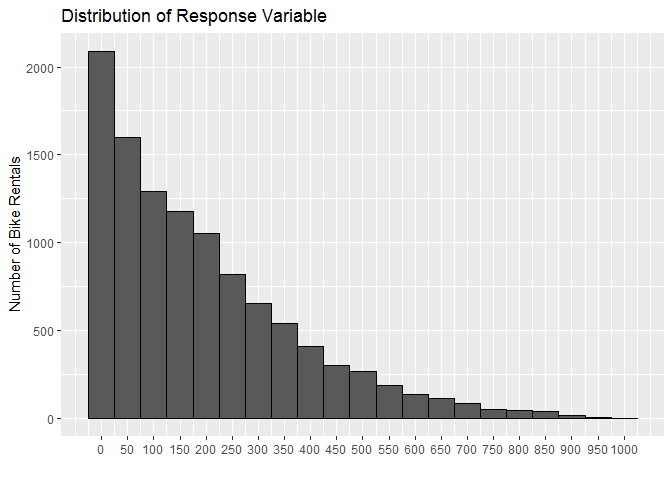 

The distribution of our response variable is highly skewed and will require transformation while using it in some algorithms.

``` r
ggplot(data = combined, aes(x = weather,y = count, fill = weather)) + geom_histogram(stat = "identity") + scale_y_continuous(breaks = seq(0,1500000,100000),labels = comma) + ylab("Total Number of Bikes Rented") + xlab("Weather") + ggtitle("Bike Rentals by Weather") + theme(plot.title = element_text(hjust = 0.5)) + scale_fill_discrete(name = "Weather") + guides(fill=FALSE)
```

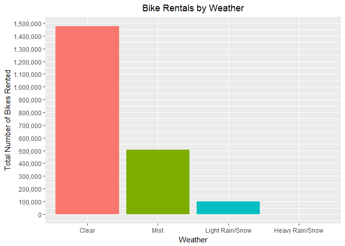

As expected most number of bikes are rented in Clear weather followed by Mist and then Light Rain/Snow. Also it seems like no bikes are rented in Heavy Rain/Snow but on taking a look at our dataset theres only one observation of bikes rented on Heavy Rain/Snow day and it the count corresponds to 164 bikes.

``` r
p1 <- ggplot(data = combined,aes(x = registered,y = casual,colour = holiday)) + geom_point() + facet_wrap(~holiday) + xlab("Registered User Bike Rentals") + ylab("Casual User Bike Rentals") + ggtitle("Registered vs Casual User Bike Rentals on Holiday") + theme(plot.title = element_text(hjust = 0.5)) + guides(colour=FALSE)

p2 <- ggplot(data = combined,aes(x = registered,y = casual,colour = workingday)) + geom_point() + facet_wrap(~workingday) + xlab("Registered User Bike Rentals") + ylab("Casual User Bike Rentals") + ggtitle("Registered vs Casual User Bike Rentals on Working Day") +  theme(plot.title = element_text(hjust = 0.5)) + guides(colour=FALSE)

library(gridExtra)
grid.arrange(p1,p2)
```

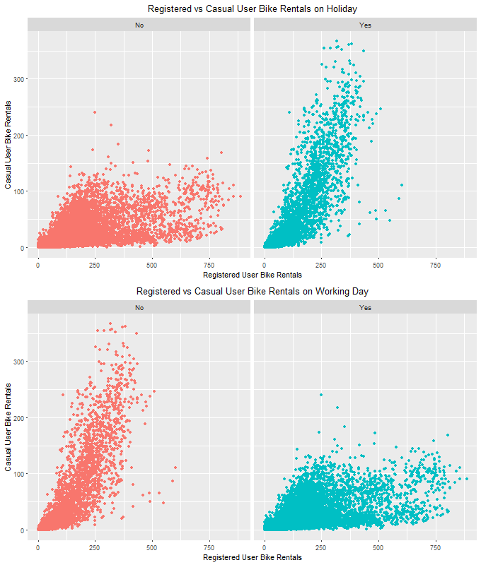

As we can see casual users rent more bikes compared to registered users if it is holiday. And more bikes are rented by registered users compared to casual users if it is a working day.

This must be due to the fact that registered users ride bikes to their jobs on working days and non registered users have enough leisure to ride bikes on holidays.

``` r
ggplot(combined, aes(x = temp , y = count,color = temp)) + geom_point() + scale_color_continuous(name = "Temperature",low = "orange",high = "red")  + xlab("Temperature") + ylab("Number of Bike Rentals") + ggtitle("Bike Rentals by Temperature") + theme(plot.title = element_text(hjust = 0.5))
```

    
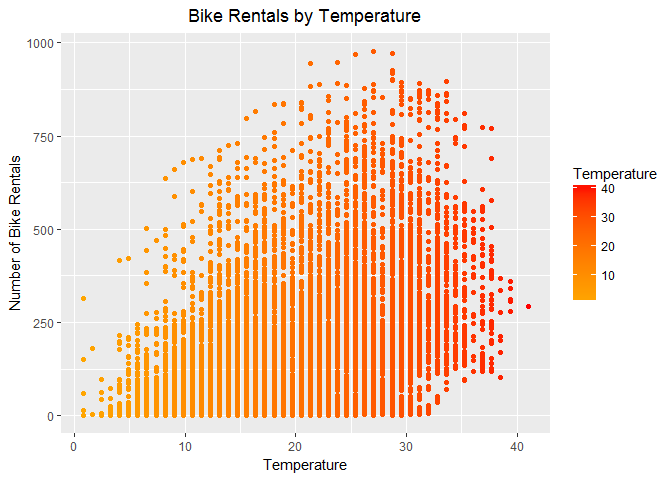

Since the bike rental is taking place in Washington, we can see that bike rentals increase with temperature.


``` r
seasonbyyear <- combined %>% group_by(season,year) %>% summarise(count = mean(count,na.rm = T)) %>% as.data.frame()

ggplot(seasonbyyear, aes(x = season,y = count ,fill = year)) + geom_histogram(stat = "identity",position = "dodge") + xlab("Season") + ylab("Average Number of Bike Rentals") + ggtitle("Bike Rentals by Season") + scale_fill_discrete(name = "Year") +  theme(plot.title = element_text(hjust = 0.5))
```

    

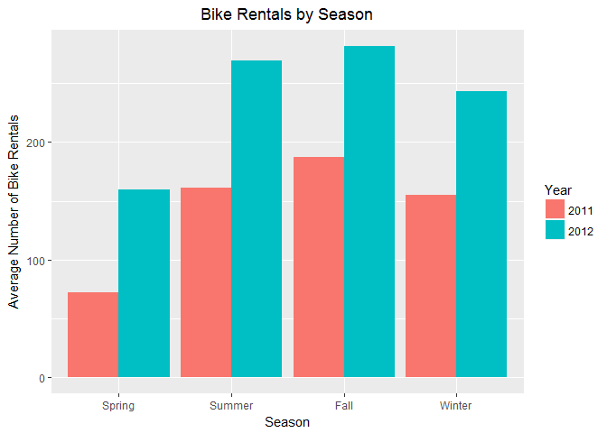

We notice that average number of bikes rented has increased in every season from 2011 to 2012.


``` r
humidity_summary <- train %>% group_by(humidity) %>% summarise(count = mean(count,na.rm = T)) %>% as.data.frame()

ggplot(humidity_summary, aes(x = humidity,y = count)) + geom_area(fill = "orange") + geom_smooth() + scale_y_continuous(limits = c(0,360),breaks = seq(0,350,50)) + scale_x_continuous(breaks = seq(0,100,10))  + xlab("Humidity") + ylab("Average Number of Bike Rentals") + ggtitle("Bike Rentals by Humidity")  +  theme(plot.title = element_text(hjust = 0.5))
```

   
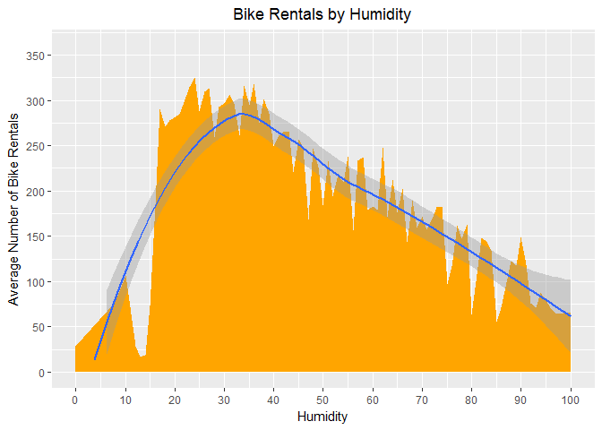 
On an average, most number of bike rentals occur in the range of 15% to 50% humidity.

This can be due to the fact that very low humidity is associated with dehydration while high humidity leads to more sweating. Both of these negatively impact a bicycle user and thus number of bikes rented decreases at extreme ends.


``` r
weekday_summary <- data.frame(combined %>% group_by(weekday,hour) %>% summarise(count = mean(count,na.rm = T)) )
```

Daily trends of bike rentals can be seen from the following animation.

``` r
library(animation)
ani.options(convert = 'C:\\Program Files\\ImageMagick-7.0.5-Q16\\convert.exe')
ani.options(interval = 0.5)
i = 1
saveGIF(while(i < nrow(weekday_summary)) {print( ggplot(data = weekday_summary[1:i,], aes(x = hour,y = count,col = weekday)) + geom_point() + geom_line(aes(group = weekday)) + scale_y_continuous(breaks = seq(0,550,50)) + scale_color_discrete(name = "Day") + xlab("Hour of the Day ") + ylab("Average Number of Bike Rentals") + ggtitle("Daily Trend of Bike Rentals by Time and Day") + theme(plot.title = element_text(hjust = 0.5))  )
   i = i + 1},movie.name = "ani_main.gif" ,ani.width = 720,ani.height = 480)
```
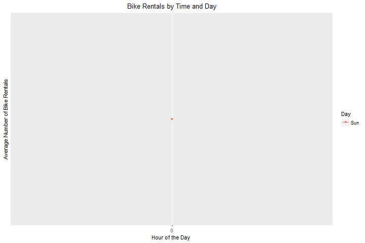


Daily trends of bike rentals can be seen from the above animation.
``` r
ggplot(data = weekday_summary,aes(x = hour,y = count,colour = weekday)) + geom_line(aes(group = weekday)) + geom_point(aes(group = weekday)) + scale_y_continuous(breaks = seq(0,550,50)) + scale_color_discrete(name = "Day") + xlab("Hour of the Day ") + ylab("Average Number of Bike Rentals") + ggtitle("Bike Rentals by Time and Day") + theme(plot.title = element_text(hjust = 0.5))
```

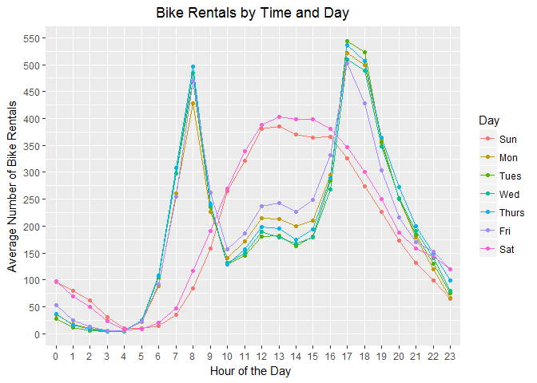

In this graph, we notice 2 peaks : 1) At 8am 2) At 6pm These must be the timings people leave for and from jobs respectively and thus bike rentals increases significantly around this time.

On the other hand, on weekends average number of bikes rented increases around 12pm which could be the time people have more free time.

## Data Modelling


Splitting the dataset back to train and test sets.

``` r
new_train <- combined[!is.na(combined$count),]
new_test <- combined[is.na(combined$count),]
```

### Using Linear Regression


``` r
lmmodel <- lm(count ~ season + holiday + weather + temp + humidity + windspeed + hour + weekday + year,data = new_train)

summary(lmmodel)
```

    ## 
    ## Call:
    ## lm(formula = count ~ season + holiday + weather + temp + humidity + 
    ##     windspeed + hour + weekday + year, data = new_train)
    ## 
    ## Residuals:
    ##     Min      1Q  Median      3Q     Max 
    ## -370.59  -60.88   -7.13   49.41  464.72 
    ## 
    ## Coefficients:
    ##                          Estimate Std. Error t value Pr(>|t|)    
    ## (Intercept)             -78.40179    9.97165  -7.862 4.12e-15 ***
    ## seasonSummer             47.84652    3.60931  13.256  < 2e-16 ***
    ## seasonFall               34.25734    4.62064   7.414 1.32e-13 ***
    ## seasonWinter             68.35700    2.97696  22.962  < 2e-16 ***
    ## holidayYes               -8.77363    6.12871  -1.432 0.152298    
    ## weatherMist             -11.50188    2.39497  -4.803 1.59e-06 ***
    ## weatherLight Rain/Snow  -69.28823    4.04705 -17.121  < 2e-16 ***
    ## weatherHeavy Rain/Snow -186.51579  101.23066  -1.842 0.065432 .  
    ## temp                      5.49803    0.22447  24.494  < 2e-16 ***
    ## humidity                 -0.61595    0.06866  -8.972  < 2e-16 ***
    ## windspeed                -0.54154    0.12869  -4.208 2.60e-05 ***
    ## hour1                   -17.09565    6.70177  -2.551 0.010758 *  
    ## hour2                   -28.42833    6.72654  -4.226 2.40e-05 ***
    ## hour3                   -39.79459    6.78950  -5.861 4.73e-09 ***
    ## hour4                   -40.63524    6.76021  -6.011 1.90e-09 ***
    ## hour5                   -24.46941    6.72379  -3.639 0.000275 ***
    ## hour6                    35.08567    6.71490   5.225 1.77e-07 ***
    ## hour7                   169.91893    6.70712  25.334  < 2e-16 ***
    ## hour8                   313.90875    6.70055  46.848  < 2e-16 ***
    ## hour9                   165.67465    6.70724  24.701  < 2e-16 ***
    ## hour10                  111.03071    6.72945  16.499  < 2e-16 ***
    ## hour11                  138.04417    6.76812  20.396  < 2e-16 ***
    ## hour12                  178.47718    6.81114  26.204  < 2e-16 ***
    ## hour13                  174.13870    6.85698  25.396  < 2e-16 ***
    ## hour14                  157.24082    6.89193  22.815  < 2e-16 ***
    ## hour15                  168.02257    6.90118  24.347  < 2e-16 ***
    ## hour16                  230.81109    6.88850  33.507  < 2e-16 ***
    ## hour17                  388.03975    6.85824  56.580  < 2e-16 ***
    ## hour18                  354.46691    6.82390  51.945  < 2e-16 ***
    ## hour19                  242.65099    6.76204  35.884  < 2e-16 ***
    ## hour20                  160.59993    6.73145  23.858  < 2e-16 ***
    ## hour21                  109.23662    6.70926  16.281  < 2e-16 ***
    ## hour22                   73.22677    6.70004  10.929  < 2e-16 ***
    ## hour23                   33.81752    6.69605   5.050 4.48e-07 ***
    ## weekdayMon               -2.17731    6.32176  -0.344 0.730540    
    ## weekdayTues               0.52658    7.12129   0.074 0.941056    
    ## weekdayWed                3.07457    7.03428   0.437 0.662060    
    ## weekdayThurs              5.58561    7.12052   0.784 0.432800    
    ## weekdayFri                8.78643    6.95876   1.263 0.206745    
    ## weekdaySat               20.60748    3.59599   5.731 1.03e-08 ***
    ## year2012                 87.76699    1.96185  44.737  < 2e-16 ***
    ## ---
    ## Signif. codes:  0 '***' 0.001 '**' 0.01 '*' 0.05 '.' 0.1 ' ' 1
    ## 
    ## Residual standard error: 101 on 10845 degrees of freedom
    ## Multiple R-squared:  0.6902, Adjusted R-squared:  0.6891 
    ## F-statistic: 604.1 on 40 and 10845 DF,  p-value: < 2.2e-16

We get R squared value of 0.69 which tells us that about 69% of variation in variable count is explained by the predictor variables.

As we saw earlier, Count is highly skewed and thus we will use it's log transformation as response variable.

``` r
lmmodel2 <- lm(log(count) ~ season + holiday + weather + temp + humidity + windspeed + hour + weekday + year,data = new_train)


summary(lmmodel2)
```

    ## 
    ## Call:
    ## lm(formula = log(count) ~ season + holiday + weather + temp + 
    ##     humidity + windspeed + hour + weekday + year, data = new_train)
    ## 
    ## Residuals:
    ##     Min      1Q  Median      3Q     Max 
    ## -4.2693 -0.2931  0.0278  0.3708  2.5744 
    ## 
    ## Coefficients:
    ##                          Estimate Std. Error t value Pr(>|t|)    
    ## (Intercept)             2.676e+00  6.128e-02  43.670  < 2e-16 ***
    ## seasonSummer            4.031e-01  2.218e-02  18.173  < 2e-16 ***
    ## seasonFall              3.415e-01  2.839e-02  12.027  < 2e-16 ***
    ## seasonWinter            5.759e-01  1.829e-02  31.480  < 2e-16 ***
    ## holidayYes             -3.086e-03  3.766e-02  -0.082   0.9347    
    ## weatherMist            -6.020e-02  1.472e-02  -4.090 4.34e-05 ***
    ## weatherLight Rain/Snow -5.645e-01  2.487e-02 -22.700  < 2e-16 ***
    ## weatherHeavy Rain/Snow -1.963e-01  6.221e-01  -0.316   0.7524    
    ## temp                    3.527e-02  1.379e-03  25.569  < 2e-16 ***
    ## humidity               -1.872e-03  4.219e-04  -4.437 9.21e-06 ***
    ## windspeed              -3.783e-03  7.908e-04  -4.783 1.75e-06 ***
    ## hour1                  -6.472e-01  4.118e-02 -15.715  < 2e-16 ***
    ## hour2                  -1.203e+00  4.134e-02 -29.110  < 2e-16 ***
    ## hour3                  -1.751e+00  4.172e-02 -41.976  < 2e-16 ***
    ## hour4                  -2.052e+00  4.154e-02 -49.384  < 2e-16 ***
    ## hour5                  -9.626e-01  4.132e-02 -23.297  < 2e-16 ***
    ## hour6                   2.729e-01  4.126e-02   6.614 3.92e-11 ***
    ## hour7                   1.270e+00  4.122e-02  30.805  < 2e-16 ***
    ## hour8                   1.905e+00  4.118e-02  46.273  < 2e-16 ***
    ## hour9                   1.576e+00  4.122e-02  38.245  < 2e-16 ***
    ## hour10                  1.247e+00  4.135e-02  30.164  < 2e-16 ***
    ## hour11                  1.365e+00  4.159e-02  32.823  < 2e-16 ***
    ## hour12                  1.552e+00  4.186e-02  37.082  < 2e-16 ***
    ## hour13                  1.525e+00  4.214e-02  36.190  < 2e-16 ***
    ## hour14                  1.441e+00  4.235e-02  34.028  < 2e-16 ***
    ## hour15                  1.499e+00  4.241e-02  35.350  < 2e-16 ***
    ## hour16                  1.762e+00  4.233e-02  41.617  < 2e-16 ***
    ## hour17                  2.176e+00  4.214e-02  51.634  < 2e-16 ***
    ## hour18                  2.093e+00  4.193e-02  49.921  < 2e-16 ***
    ## hour19                  1.801e+00  4.155e-02  43.331  < 2e-16 ***
    ## hour20                  1.501e+00  4.137e-02  36.294  < 2e-16 ***
    ## hour21                  1.242e+00  4.123e-02  30.123  < 2e-16 ***
    ## hour22                  9.988e-01  4.117e-02  24.259  < 2e-16 ***
    ## hour23                  5.993e-01  4.115e-02  14.564  < 2e-16 ***
    ## weekdayMon             -7.167e-02  3.885e-02  -1.845   0.0651 .  
    ## weekdayTues            -8.623e-02  4.376e-02  -1.971   0.0488 *  
    ## weekdayWed             -7.583e-02  4.323e-02  -1.754   0.0794 .  
    ## weekdayThurs           -7.632e-05  4.376e-02  -0.002   0.9986    
    ## weekdayFri              9.903e-02  4.276e-02   2.316   0.0206 *  
    ## weekdaySat              1.178e-01  2.210e-02   5.330 1.00e-07 ***
    ## year2012                4.930e-01  1.206e-02  40.891  < 2e-16 ***
    ## ---
    ## Signif. codes:  0 '***' 0.001 '**' 0.01 '*' 0.05 '.' 0.1 ' ' 1
    ## 
    ## Residual standard error: 0.6207 on 10845 degrees of freedom
    ## Multiple R-squared:  0.8269, Adjusted R-squared:  0.8262 
    ## F-statistic:  1295 on 40 and 10845 DF,  p-value: < 2.2e-16

We get a significant increase in R squared value and now it is 0.82, denoting that about 82% of variation is explained.

We shall compute RMSE to compare the result of linear regression model with other models.

``` r
library(Metrics)
selfpredictlm <- predict(lmmodel2,newdata = new_train)
new_train$lmmodelpredict <- round(exp(selfpredictlm))
paste("Rmse for Linear Regression Model is:" ,rmse(new_train$count,new_train$lmmodelpredict))
```

    ## [1] "Rmse for Linear Regression Model is: 98.5790446089307"

### Using Decision Tree


Lets try using decision tree algorithm to predict count.

``` r
library(rpart)
library(rpart.plot)
library(rattle)
library(RColorBrewer)

Treemodel <- rpart(count ~ season + holiday + weather + temp + humidity + windspeed + hour + weekday + year, data = new_train, method = "class")


printcp(Treemodel)
```

    ## 
    ## Regression tree:
    ## rpart(formula = count ~ season + holiday + weather + temp + humidity + 
    ##     windspeed + hour + weekday + year, data = new_train, method = "class")
    ## 
    ## Variables actually used in tree construction:
    ## [1] holiday hour    season  temp    year   
    ## 
    ## Root node error: 357172914/10886 = 32810
    ## 
    ## n= 10886 
    ## 
    ##          CP nsplit rel error  xerror      xstd
    ## 1  0.360230      0   1.00000 1.00020 0.0174137
    ## 2  0.102632      1   0.63977 0.64235 0.0127945
    ## 3  0.058803      2   0.53714 0.54582 0.0101152
    ## 4  0.040309      3   0.47834 0.47094 0.0084452
    ## 5  0.030748      4   0.43803 0.42627 0.0077568
    ## 6  0.026609      5   0.40728 0.40294 0.0071259
    ## 7  0.021815      6   0.38067 0.37330 0.0066517
    ## 8  0.019199      7   0.35885 0.35175 0.0064923
    ## 9  0.018747      8   0.33966 0.33962 0.0062437
    ## 10 0.015147     10   0.30216 0.32013 0.0058132
    ## 11 0.014120     11   0.28702 0.29481 0.0055542
    ## 12 0.013656     12   0.27290 0.28506 0.0054558
    ## 13 0.011181     13   0.25924 0.26279 0.0051215
    ## 14 0.010000     14   0.24806 0.25459 0.0050235

To avoid overfitting we must prune our decision tree. A rule of thumb is to choose the lowest level where the rel error + xstd is less than xerror which is 0.01. The optimum value of complexity parameter can also be found out from cp graph.

``` r
plotcp(Treemodel)
```

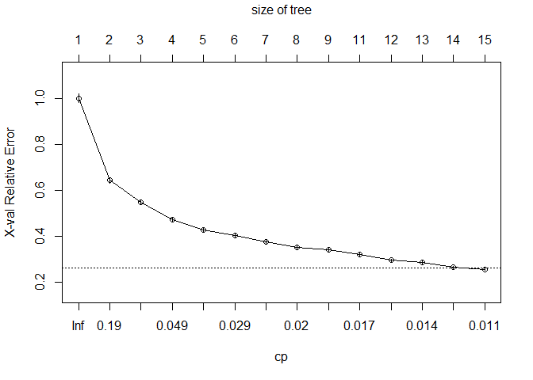 

As also evident from cp graph, complexity parameter of 0.01 is optimum for pruning the decision tree.

``` r
Prunedtree <- prune(Treemodel,cp = 0.01)

fancyRpartPlot(Prunedtree,sub = "Bike Rental Decision Tree",cex = 0.5)
```

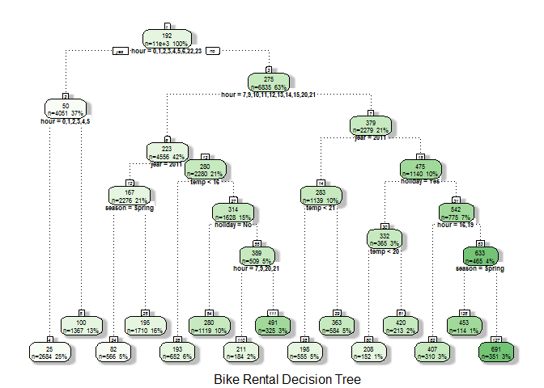

Lets compute the RMSE of pruned decision tree model

``` r
selfpredictdt <- predict(Prunedtree,newdata = new_train)
 
paste("RMSE for decision tree is:",rmse(new_train$count,round(selfpredictdt)))
```

    ## [1] "RMSE for decision tree is: 90.2161376768925"

We get a minor improvement in RMSE using decision tree as compared to linear regression model.

### Using Random Forest


Lets try predicting count using random forest.

``` r
library(randomForest)

set.seed(999)

rfmodel <- randomForest(data = new_train,importance = TRUE,ntree = 250,count ~ season + holiday + weather + temp + humidity + windspeed + hour + year )
rfmodel
```

    ## 
    ## Call:
    ##  randomForest(formula = count ~ season + holiday + weather + temp +      humidity + windspeed + hour + year, data = new_train, importance = TRUE,      ntree = 250) 
    ##                Type of random forest: regression
    ##                      Number of trees: 250
    ## No. of variables tried at each split: 2
    ## 
    ##           Mean of squared residuals: 3584.52
    ##                     % Var explained: 89.08

``` r
varImpPlot(rfmodel)
```

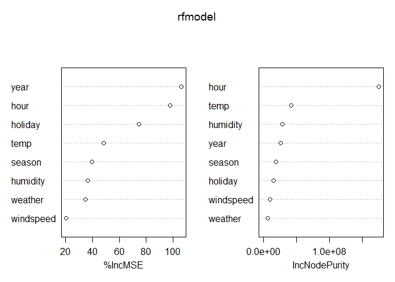

We can see that Year, Hour,Temperature and Holiday are some of the important variables.
``` r
selfpredictrf <- predict(rfmodel,newdata = new_train)
new_train$rfmodelpredict <- round(selfpredictrf)
paste("RMSE for random Forest is:", rmse(new_train$count,new_train$rfmodelpredict))
```

    ## [1] "RMSE for random Forest is: 40.1412339892129"

Using random model our RMSE has improved substantially.

That is why we will use random forest algorithm to predict the number of casual and registered users.

``` r
rfmodelcas <- randomForest(data = new_train,importance = TRUE,ntree = 250,casual ~ season + holiday + weather + temp + humidity + windspeed + hour + year )
rfmodelcas
```

    ## 
    ## Call:
    ##  randomForest(formula = casual ~ season + holiday + weather +      temp + humidity + windspeed + hour + year, data = new_train,      importance = TRUE, ntree = 250) 
    ##                Type of random forest: regression
    ##                      Number of trees: 250
    ## No. of variables tried at each split: 2
    ## 
    ##           Mean of squared residuals: 324.7255
    ##                     % Var explained: 86.99

``` r
varImpPlot(rfmodelcas)
```

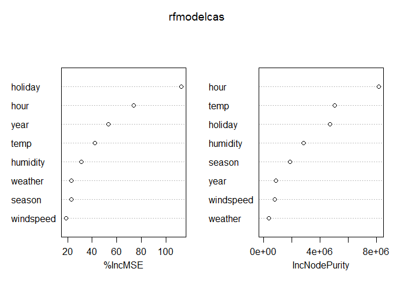

From above plot we can see that for casual users holiday is the most important variable (as was evident from graphs also) followed by hour.

``` r
rfmodelreg <- randomForest(data = new_train,importance = TRUE,ntree = 250,registered ~ season + holiday + weather + temp + humidity + windspeed + hour + year )
rfmodelreg
```

    ## 
    ## Call:
    ##  randomForest(formula = registered ~ season + holiday + weather +      temp + humidity + windspeed + hour + year, data = new_train,      importance = TRUE, ntree = 250) 
    ##                Type of random forest: regression
    ##                      Number of trees: 250
    ## No. of variables tried at each split: 2
    ## 
    ##           Mean of squared residuals: 2074.822
    ##                     % Var explained: 90.9

``` r
varImpPlot(rfmodelreg)
```

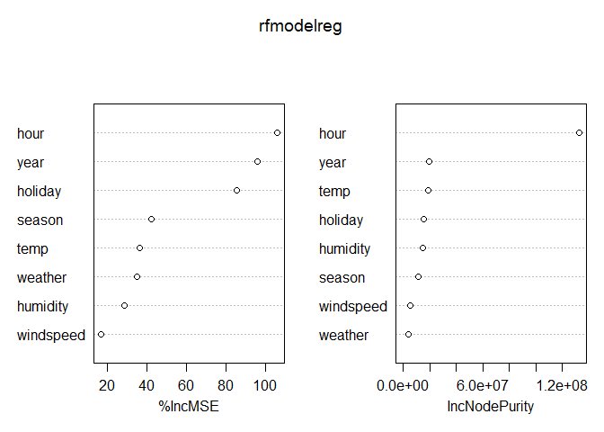 
For Registered users hour seems to be most important variable in determining bike demand as they must be consisting of daily office goers.

``` r
caspredict <- predict(rfmodelcas,newdata = new_train)
new_train$rfmodelcaspredict <- round(caspredict)

regpredict <- predict(rfmodelreg,newdata = new_train)
new_train$rfmodelregpredict <- round(regpredict)

new_train$rfmodelcasregpredict <- new_train$rfmodelcaspredict + new_train$rfmodelregpredict
rmse(new_train$count,new_train$rfmodelcasregpredict)
```

    ## [1] 36.91844

We can see that our rmse has decreased even further and thus we shall use this model for prediction.

## Predicting the Bike Demand for Test dataset using Random Forest Models

``` r
caspredict <- predict(rfmodelcas,newdata = new_test)
caspredict <- round(caspredict)

regpredict <- predict(rfmodelreg,newdata = new_test)
regpredict <- round(regpredict)

prediction <- caspredict + regpredict


sub_file <- data.frame(datetime = new_test$datetime,count = prediction)

write.csv(sub_file, "Predicted_Testrfcasreg.csv",row.names = FALSE,quote = FALSE)
```
